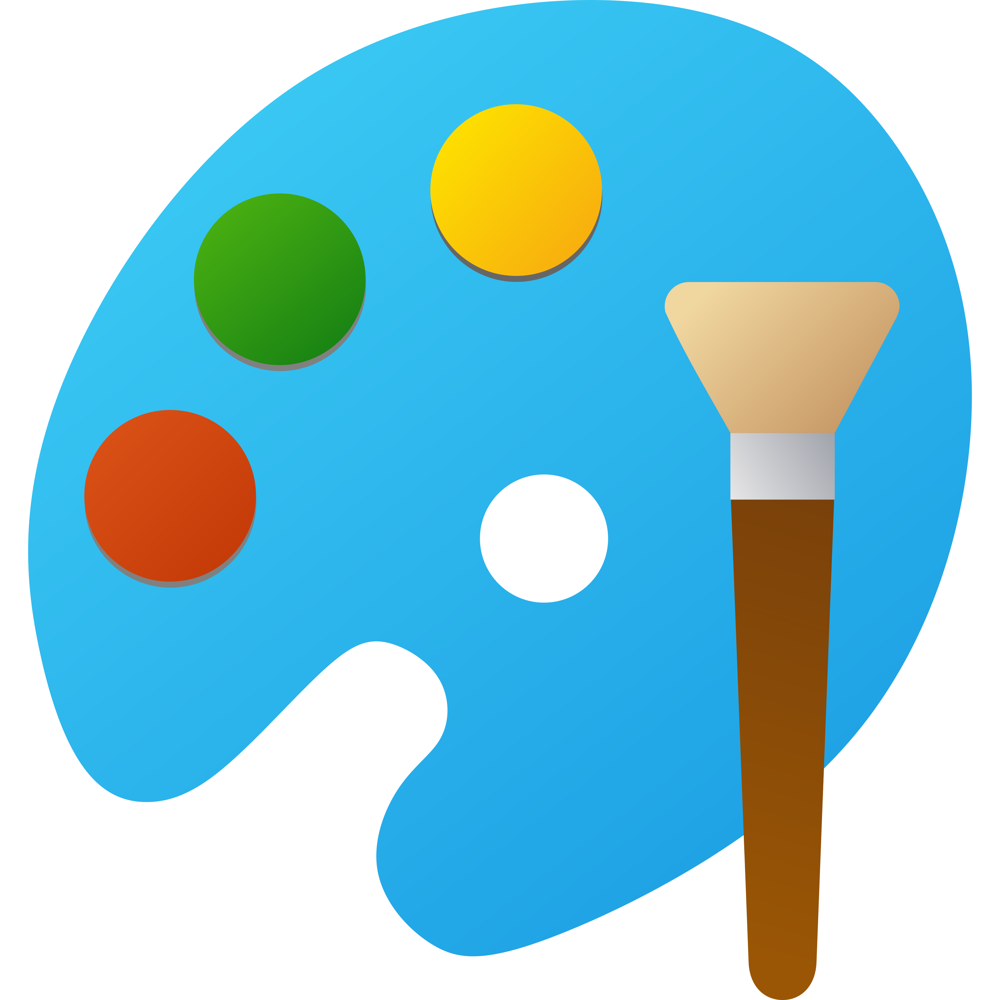

# Raad Spotfire test app

## 1. Why?
Because spotfire does not have a paint app, do you think it's necessary? Of course NOT



## 2. Building the Project
In a terminal window:
- `npm install`
- `npm run build-watch`

In a new terminal window:
- `npm run server`


If not run execute with this flag on enviroment
```shell
$env:NODE_OPTIONS = "--openssl-legacy-provider"
```

## 3. Usefull info about mods:

- The .mod file is just a .zip file with a .json behind the scene.
- Mod is loaded in spotfire as a DocumentNode, the same as everything
- d3.js is the library use for visualization but can be used whatever you want, like chart.js
- SVG file is generated to plot visualizations.